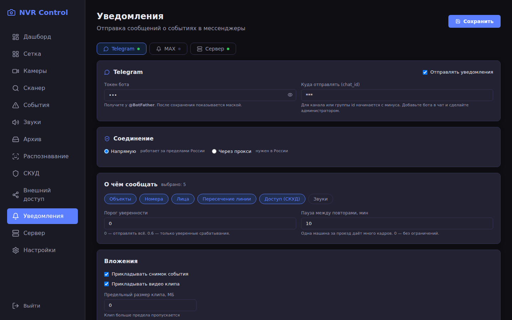
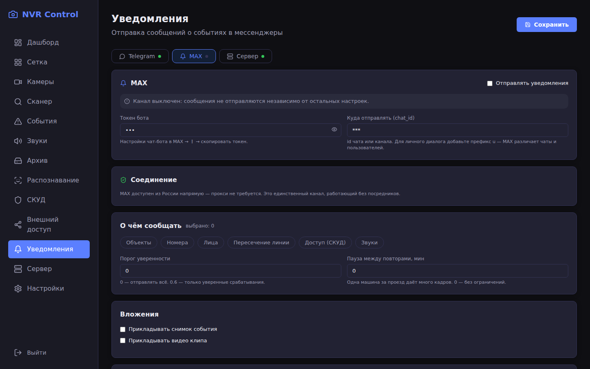
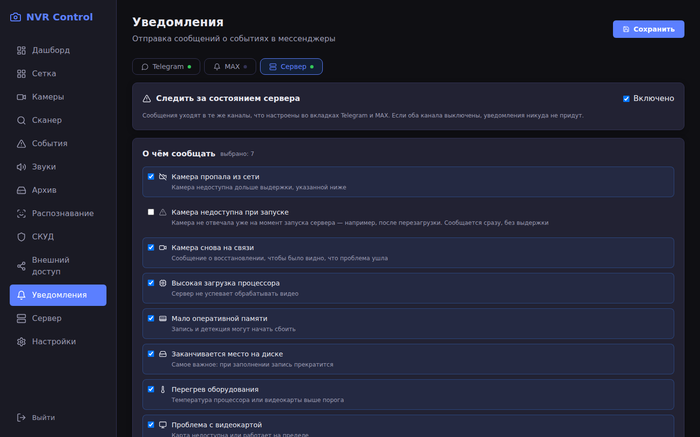
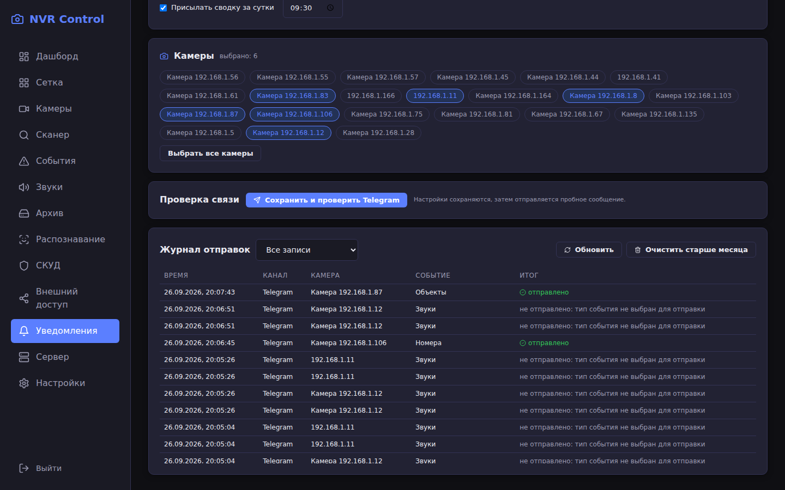
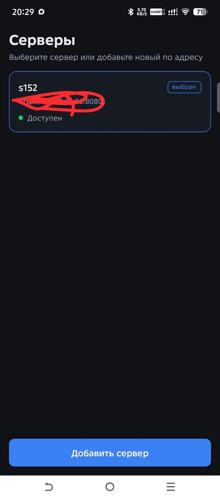
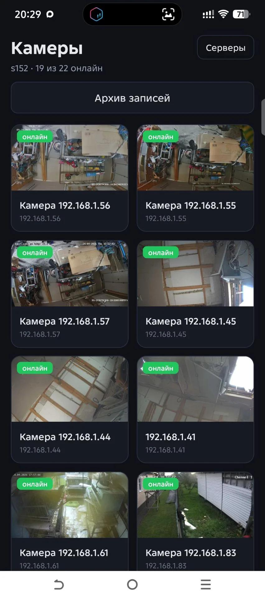
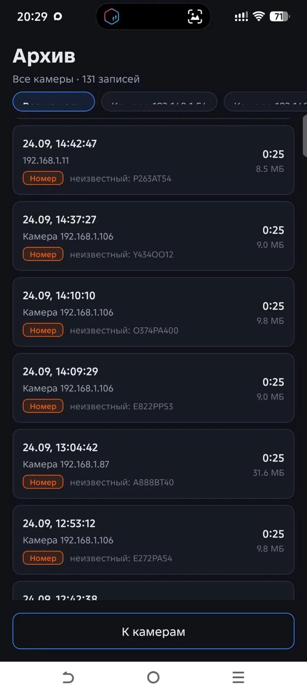
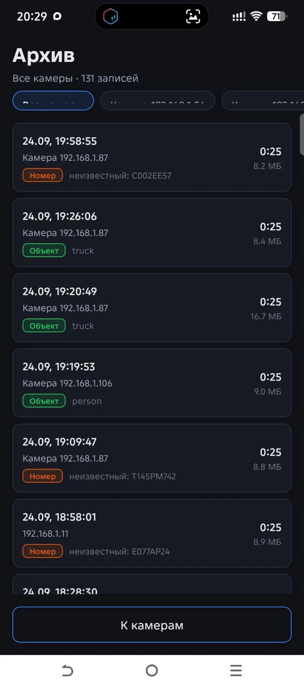
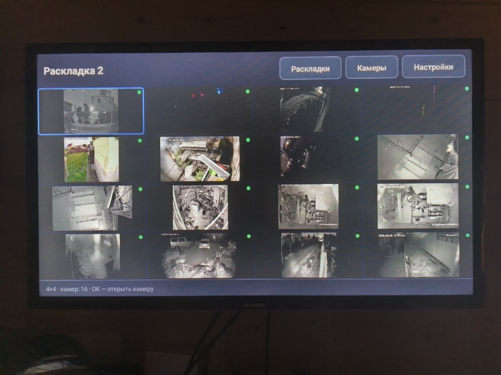

# OpenIPC NVR — сервер видеонаблюдения с AI-детекцией и СКУД

Сервер видеонаблюдения для распределённых IP-камер (OpenIPC, Hikvision, Dahua, Vivotek, ONVIF)
с детекцией объектов и звуков на нейросетях, распознаванием лиц и номеров,
интеграцией систем контроля доступа и веб-интерфейсом.

```
┌──────────────┐  RTSP   ┌────────────┐  HLS/WebRTC  ┌──────────────┐
│   Камеры     │────────▶│ MediaMTX   │─────────────▶│  Web UI      │
│ OpenIPC/ONVIF│         │ (медиасервер)│             │  React SPA   │
└──────────────┘         └─────┬──────┘              └──────┬───────┘
                               │                            │ REST
                    ┌──────────┴──────────┐                 │
                    │  звук камеры (AAC)  │                 │
                    └──────────┬──────────┘                 │
┌──────────────┐   NATS  ┌─────▼────────────────────────────▼───────┐
│ AI Detector  │────────▶│        Go Backend (API + логика)         │
│ YOLOv8 +     │         └────┬──────────┬───────────┬──────────────┘
│ YAMNet +     │              │          │           │
│ InsightFace  │        ┌─────▼───┐ ┌────▼────┐ ┌────▼──────┐
└──────────────┘        │PostgreSQL│ │ MinIO   │ │   СКУД    │
                        │метаданные│ │  архив  │ │Hikvision/ │
                        └──────────┘ └─────────┘ │Dahua/     │
                                                  │Promwad    │
                                                  └───────────┘
```

---

## Возможности

| Раздел | Что реализовано |
|---|---|
| **Камеры** | Добавление и правка через веб-интерфейс (данные в PostgreSQL, без ручных конфигов), сканер подсети (ONVIF, mDNS, HTTP-зондирование, перебор учётных данных), **проверка потока до сохранения** с показом кодека, разрешения и наличия звука |
| **Потоки** | RTSP-приём через MediaMTX, HLS для браузера, WebRTC, основной и дополнительный поток, проксирование через бэкенд с JWT-авторизацией |
| **Внешний RTSP-доступ** | Выдача потоков сторонним системам (видеостены, регистраторы, аналитика) по адресам `/cameras/{N}/streaming/{main\|sub}` на отдельном порту 9784. Номера каналов назначаются автоматически, страница **Внешний доступ** показывает готовые ссылки. Потоки отдаются без перекодирования — нагрузка на камеры не растёт |
| **Звук с камер** | Прослушивание в плеере, автоматическое перекодирование G.711 → AAC (браузеры не играют G.711 в HLS), отдельная аудиодорожка, синхронная с видео |
| **Детекция объектов** | YOLOv8 с трекингом. Фильтры точности: порог уверенности, минимальный и максимальный размер объекта, отношение сторон рамки, отсечение неподвижных объектов. Настройка отдельно для каждой камеры — [docs/DETECTION-QUALITY.md](docs/DETECTION-QUALITY.md) |
| **Распознавание лиц** | InsightFace (ArcFace): эмбеддинги, справочник известных лиц, отметки «известный» / «неизвестный» / «запрещённый» |
| **Распознавание номеров** | Детекция области номера, OCR, настраиваемая зона поиска (чтобы не захватывать OSD-меню камеры), проверка формата по региону |
| **PTZ** | Поворотные камеры по ONVIF: направление, зум, стоп, пресеты, регулировка шага |
| **Управление камерами** | Настройки камеры через HTTP API прошивки (Majestic) без SSH: видео, изображение, ночной режим, OSD, перезапуск. Для камер без API остаётся SSH |
| **Здоровье камер** | Опрос `/metrics` и `/api/v1/sources` раз в минуту: загрузка CPU, свободная память, fps сенсора, обрывы энкодера. Оценка «норма / внимание / проблема» с пояснением причин |
| **Превью** | Кадр с камеры вместо видеопотока в списке камер: один HTTP-запрос вместо RTSP-сессии. Поддержка Basic и Digest-авторизации, резервное получение из RTSP |
| **События** | Хранение детекций от AI (класс, уверенность, bbox, трек), привязка к триггеру (объект / линия / лицо / номер), фильтры и пагинация |
| **Архив** | Запись по триггеру или постоянно, метаданные в PostgreSQL, файлы локально или в MinIO, воспроизведение в браузере, автоочистка по сроку хранения |
| **СКУД** | Адаптеры Hikvision (ISAPI), Dahua, Promwad: список дверей, открытие, события проходной |
| **Настройки сервера** | Единая страница: пути хранения записей и снимков, локальный диск или S3, параметры распознавания |
| **Мониторинг** | Автоматическое определение статуса камер (online/offline), восстановление путей после перезапуска медиасервера, очистка «висячих» путей |
| **Уведомления** | Telegram и MAX: события детекции со снимком или клипом, выбор камер и типов событий, порог уверенности, тихие часы, журнал отправок. Отдельно — наблюдение за сервером: пропажа камер, загрузка CPU, память, диск, перегрев и видеокарта |
| **Снапшоты** | Кадр с камеры по вендорским путям, резервное извлечение из HLS, снимки событий в ленте |
| **Мобильное приложение** | Android для телефона: выбор сервера, просмотр камер и архива. Отдельная сборка для **Android TV**: сетки от 1 до 25 камер, раскладки, звук. Подробности — [ниже](#мобильное-приложение) |

---

## Интерфейс

### Камеры и просмотр

Плитки показывают живой кадр каждой камеры, статус и адреса потоков.
Переключение `main`/`sub` прямо в плитке, отдельная кнопка удаления.


В карточке камеры — плеер с основным или дополнительным потоком,
кнопка звука и пульт PTZ для поворотных моделей.


### Звук

Камера отдаёт звук в G.711, который браузеры не воспроизводят в HLS,
поэтому система перекодирует его в AAC и отдаёт отдельной дорожкой.
На панели видно кодек камеры, идёт ли перекодирование
и распознаются ли звуковые события.


Звуковые события от YAMNet: выстрел, крик, разбитое стекло, лай собаки
и другие. Фильтры по классам и подсветка тревожных событий.


### Детекция объектов

Классы объектов, минимальная уверенность, зона поиска и линия пересечения.
Настройки применяются к конкретной камере и подхватываются детектором
автоматически, без перезапуска.


Найденные объекты заносятся в журнал со снимком, классом, уверенностью
и привязкой к камере.


### Архив

Записи с указанием причины (объект, лицо, номер, линия, непрерывная запись),
размером, разрешением и сроком хранения. Воспроизведение прямо в браузере.


### Распознавание и СКУД

Справочники известных лиц и автомобильных номеров со статусами
«известный», «неизвестный», «запрещённый».


Сканер находит камеры в подсети, а перед добавлением можно проверить
поток: кодек, разрешение и наличие звука.


### Настройки и обзор

Единая страница настроек: где хранить записи и снимки (диск или S3),
параметры распознавания, срок хранения.


Сводка состояния системы: камеры онлайн, события за сутки, занятое место.


### Уведомления

События уходят в Telegram и MAX: снимок или видеоклип, выбор камер,
типов событий, порог уверенности и тихие часы. Каждый канал настраивается
отдельно, отказ одного не мешает другому.



MAX — единственный канал, доступный из России напрямую, без прокси.
Rest API у него заметно строже к формату сообщений, поэтому текст
собирается отдельно от Telegram, а не переиспользуется.



Отдельная вкладка — наблюдение за самим сервером: пропала камера, высокая
загрузка процессора, мало памяти, кончается диск, перегрев, сбой видеокарты.
Для замера температуры и видеокарты нужен агент на хосте: из контейнера
их не видно.



Журнал показывает, что и куда ушло, и почему что-то не ушло —
например, тип события не выбран для отправки. По нему видно состояние
доставки, не заходя в мессенджер.



> Снимки сделаны на реальной системе. Пересоздать их можно командой
> `node scripts/make-screenshots.js` при запущенном сервере.
> Токены и адреса чатов на снимках затираются автоматически.

---

## Мобильные приложения

Одно приложение на React Native собирается в двух видах: для телефона
и для телевизора. Вид выбирается сам по типу устройства — на телевизоре
и телефонный интерфейс работал бы, но пультом по нему не попасть.

### Телефон

Подключение к серверу по IP-адресу, порту или DNS-имени, онлайн-просмотр
камер и работа с архивом.

| Экран | Возможности |
|---|---|
| **Серверы** | Список сохранённых серверов, добавление, проверка связи до сохранения, переключение, удаление |
| **Вход** | Логин и пароль; токен хранится отдельно для каждого сервера, поэтому переключение между ними не требует повторного входа |
| **Камеры** | Плитки с превью-кадрами (обновление раз в 10 секунд), статус онлайн/офлайн, обновление жестом вниз |
| **Просмотр** | Онлайн-видео по HLS, переключение основного и дополнительного потока, пауза, звук |
| **Архив** | Список записей с фильтром по камере, встроенный плеер с перемоткой, подгрузка при прокрутке. Причина записи видна сразу: номер, лицо, объект |

| Серверы | Камеры | Архив: номера | Архив: объекты |
|---|---|---|---|
|  |  |  |  |

Счётчик рядом с именем сервера показывает, сколько камер в сети из общего
числа: на снимке 19 из 22. Камеру можно отфильтровать по адресу, а запись
открыть прямо из списка — например, «неизвестный: P263AT54».

### Android TV

Сборка для телевизора и приставки: сетка до 25 камер, раскладки и звук.
Управление пультом, плитки крупные — их видно с дивана.



**Сетки:** 1, 2, 4, 6, 9, 16 и 25 камер. Форма подбирается под экран
телевизора, а не под квадрат: 6 камер — это 3×2, а не 2×3, иначе плитки
вытянуты по вертикали и по бокам остаются чёрные полосы.

**Раскладки:** набор камер, размер сетки, подписи и звук сохраняются под
именем («Вход», «Ночная смена») и переключаются одной кнопкой. У каждого
сервера свои раскладки. Порядок выбранных камер задаёт их место в сетке,
поэтому в списке выбора показывается номер плитки, а не галочка.

**Звук:** включается для одной камеры за раз. Звук с нескольких камер
одновременно сливается в шум, а оператору нужна конкретная.

> В плотных сетках (16 и 25 камер) подписи на плитках скрываются
> автоматически: на такую плитку приходится около сотни пикселей, и имя
> закрыло бы половину изображения. Остаётся точка состояния в углу.

Звук идёт отдельной дорожкой: MediaMTX отдаёт видео без звука, и сервер
публикует аудио отдельным потоком. В сетке играется дополнительный поток
вместо основного — четыре основных потока 4K потребовали бы больше
60 Мбит/с, чего не выдержит ни Wi-Fi телевизора, ни его декодер.

| Экран | Что делает |
|---|---|
| **Сетка** | Камеры по раскладке, фокус на плитке, открытие на весь экран или включение звука по «ОК» |
| **Раскладки** | Создание, выбор, удаление; у каждой — размер сетки и состав камер |
| **Камеры** | Выбор камер в раскладку, порядок задаёт расположение |
| **Настройки** | Подписи (имя, состояние, часы), звук, громкость, камера со звуком |

### Сборка приложений

```bash
cd mobile
npm install
echo "sdk.dir=$HOME/Android/Sdk" > android/local.properties

cd android
JAVA_HOME=/usr/lib/jvm/java-17-openjdk-amd64 ./gradlew assembleDebug
adb install -r app/build/outputs/apk/debug/app-debug.apk
```

> Требуется **JDK 17**: на JDK 21 сборка падает с ошибкой
> `jlink executable ... does not exist`.

APK собирается под обе ARM-архитектуры: `arm64-v8a` для современных
устройств и `armeabi-v7a` для приставок и телевизоров постарше. Готовый
файл — около 76 МБ. Узнать архитектуру устройства можно так:

```bash
adb shell getprop ro.product.cpu.abi
```

> Если в APK нет подходящей архитектуры, установка падает с ошибкой
> `INSTALL_FAILED_NO_MATCHING_ABIS`. Значения `abiFilters` в
> `app/build.gradle` и `reactNativeArchitectures` в `gradle.properties`
> должны совпадать: первое решает, какие готовые библиотеки попадут
> в APK, второе — под что компилируется C++ самого React Native.

**Технологии:** React Native 0.75, `react-native-video` (ExoPlayer/Media3),
TypeScript. Видео идёт по HLS через API сервера, архив — готовыми файлами MP4.

### Подключение

Адрес вводится в любом виде, приложение приводит его к одному виду:

| Ввод | Результат |
|---|---|
| `192.168.1.10` | `http://192.168.1.10:8080` |
| `192.168.1.10:9000` | `http://192.168.1.10:9000` |
| `nvr.local` | `http://nvr.local:8080` |
| `https://cam.example.com` | `https://cam.example.com` |

Кнопка **Проверить связь** обращается к `/health` сервера — ошибку в адресе
или порту видно до сохранения.

### Отличия от веб-интерфейса

В приложениях нет детекции, событий, СКУД, PTZ и настроек камер — это
инструмент просмотра и наблюдения. Управление остаётся в веб-интерфейсе.

Полное руководство: [docs/MOBILE.md](docs/MOBILE.md) — установка Android SDK,
разбор ошибки «Unable to load script», уменьшение размера APK, запуск с
hot reload.

---

## Быстрый старт

### Требования

- Linux (проверено на Ubuntu)
- Docker 24+ и Docker Compose v2
- 2 ГБ ОЗУ и 10 ГБ диска минимум
- Камеры в той же сети, доступные по RTSP

### Установка

```bash
git clone https://github.com/himik19872/OpenIPC-NRV.git
cd OpenIPC-NRV

# Создаём конфигурацию и задаём секреты
cp .env.example .env
sed -i "s|^JWT_SECRET=.*|JWT_SECRET=$(openssl rand -hex 32)|" .env

# Запускаем
./scripts/nvr.sh start
```

Скрипт выведет адреса для доступа. Веб-интерфейс — `http://<IP сервера>:3001`,
вход `admin` / `admin123`.

> **Сразу смените пароль администратора.** Учётная запись создаётся сид-миграцией
> с общеизвестными данными.

### Добавление камер

1. Откройте раздел **Сканер** и укажите подсеть, например `192.168.1.0/24`.
2. Нажмите **Сканировать** — найденные камеры появятся списком.
3. Выберите нужные и добавьте: пути к потокам и учётные данные подставятся автоматически.
4. Либо добавьте вручную в разделе **Камеры**, указав `main_stream` и `sub_stream`.

Для камер OpenIPC используйте учётные данные, заданные в Majestic
(по умолчанию в проекте — `root` и пароль из прошивки).

---

## Автозапуск при загрузке

```bash
sudo ./scripts/install-service.sh
```

Создаётся служба systemd `nvr`, которая поднимает контейнеры при старте системы.
Контейнеры дополнительно имеют политику `restart: unless-stopped`, поэтому
перезапускаются после сбоев автоматически.

```bash
systemctl status nvr          # состояние службы
journalctl -u nvr -f          # логи запуска
sudo ./scripts/install-service.sh --uninstall   # удалить автозапуск
```

---

## Управление

```bash
./scripts/nvr.sh start      # запустить
./scripts/nvr.sh stop       # остановить
./scripts/nvr.sh restart    # перезапустить
./scripts/nvr.sh status     # состояние и адреса
./scripts/nvr.sh logs       # логи
./scripts/nvr.sh update     # пересобрать образы и обновить
./scripts/nvr.sh backup     # дамп базы данных в ./backups
```

---

## Документация

| Документ | Содержание |
|---|---|
| [docs/DEPLOYMENT.md](docs/DEPLOYMENT.md) | Подробное развёртывание, настройка, TLS, удалённый доступ |
| [docs/EXTERNAL-RTSP.md](docs/EXTERNAL-RTSP.md) | Выдача потоков сторонним системам: адреса, учётные данные, **принцип вывода OSD** |
| [docs/API.md](docs/API.md) | Полное описание REST API с примерами |
| [docs/DETECTION-QUALITY.md](docs/DETECTION-QUALITY.md) | Настройка точности детекции: как убрать ложные срабатывания и вернуть объект в запись |
| [docs/MOBILE.md](docs/MOBILE.md) | Android-приложение: возможности, сборка, установка, разбор ошибок |
| [docs/ROADMAP.md](docs/ROADMAP.md) | План развития: CUDA-детекция, Home Assistant |
| [docs/ARCHITECTURE.md](docs/ARCHITECTURE.md) | Устройство системы, схема БД, принятые решения |
| [docs/TROUBLESHOOTING.md](docs/TROUBLESHOOTING.md) | Диагностика типовых проблем |
| [plans/](plans/) | Исходный проектный план |

Интерактивный список эндпоинтов доступен на работающем сервере:
`http://<IP сервера>:8080/api/v1/docs`

---

## Архитектура

| Компонент | Технология | Назначение |
|---|---|---|
| Бэкенд | Go 1.22, chi, pgx | REST API, бизнес-логика, управление камерами |
| Веб-интерфейс | React 18, TypeScript, Vite | SPA с плеером HLS, пультом PTZ и настройками |
| Медиасервер | MediaMTX | Приём RTSP, раздача HLS/WebRTC, запись |
| Мобильное приложение | React Native, ExoPlayer | Просмотр камер и архива с телефона и телевизора Android |
| Уведомления | Telegram Bot API, MAX Bot API | Сообщения о событиях детекции и состоянии сервера |
| AI-детектор | Python, YOLOv8, YAMNet, InsightFace | Объекты, звуки, лица, номера (GPU CUDA) |
| Шина событий | NATS JetStream | Кадры от камер к детектору, события в БД |
| База данных | PostgreSQL 16 | Камеры, события, архив, звук, справочники лиц и номеров |
| Хранилище | MinIO (S3) либо локальный диск | Видеоархив и снимки |

### Структура репозитория

```
backend/            Go-бэкенд
  cmd/server/       точка входа
  internal/
    api/            роутер и HTTP-обработчики
    service/        бизнес-логика, PTZ, SSH, сканер, звук, распознавание
    repository/     PostgreSQL и MinIO
    media/          интеграция с медиасервером
    monitor/        наблюдение за камерами и железом, пороги и напоминания
    notify/         отправка в Telegram и MAX, сборка сообщений, журнал
    nats/           подписки на события детекции и звука
    sysinfo/        опрос процессора, памяти, диска (Linux)
    tunnel/         управление WireGuard
  migrations/       SQL-миграции (001-007)
webui/              React SPA
mobile/             приложения на React Native (телефон и ТВ в одной сборке)
  src/net/          клиент API и разбор адреса сервера
  src/screens/      экраны телефона: серверы, вход, камеры, просмотр, архив
  src/tv/           телевизионный режим: сетка, раскладки, настройки
  src/storage/      сохранение раскладок и серверов на устройстве
  src/state/        выбранный сервер, токен, клиент
  android/          нативная часть: сборка APK, определение телевизора
ai-detector/        Python-сервис детекции (объекты, звук, лица, номера)
scripts/            скрипты управления и установки
docs/               документация
plans/              проектные материалы
```

---

## Разработка

### Бэкенд

```bash
cd backend
go build ./...          # сборка
go vet ./...            # статический анализ
go test ./...           # тесты
```

Локальный запуск требует PostgreSQL на `localhost:5434`:

```bash
docker compose up -d postgres minio mediamtx nats
go run ./cmd/server
```

### Веб-интерфейс

```bash
cd webui
npm install
npm run dev             # dev-сервер на :3000 с прокси на :8080
npm run build           # production-сборка
```

### AI-детектор

```bash
cd ai-detector
pip install -r requirements.txt
python frame_publisher.py --rtsp rtsp://localhost:8554/<camera-id> --camera-id <uuid>
python main.py
```

Модель `yolov8n.pt` скачивается автоматически при первом запуске.

---

## Безопасность

Перед выводом сервера в интернет:

- [ ] Сменить `JWT_SECRET` (`openssl rand -hex 32`) и `DB_PASSWORD`
- [ ] Сменить пароль администратора в веб-интерфейсе
- [ ] Сменить пароль внешнего RTSP-доступа (`MTX_EXTERNAL_PASS`) — по умолчанию `viewer`
- [ ] Закрыть порты PostgreSQL (5434), MinIO (9000/9001), NATS (4222) от внешней сети
- [ ] Настроить TLS-терминацию (nginx/Caddy) перед веб-интерфейсом
- [ ] Ограничить доступ к MediaMTX API (9997)
- [ ] Не использовать учётные данные камер по умолчанию

Подробнее — в [docs/DEPLOYMENT.md](docs/DEPLOYMENT.md).

---

## Известные ограничения

| Ограничение | Причина | Обходной путь |
|---|---|---|
| Двусторонняя связь через динамик камеры не работает | Камеры не поддерживают обратный аудиоканал: в ответе `RTSP OPTIONS` нет методов `ANNOUNCE` и `RECORD`. Конвейер реализован и заработает на камерах с такой поддержкой | Проверяется автоматически: кнопка разговора появляется только при поддержке |
| Детекция звука расходует CPU | YAMNet работает на CPU, чтобы не конкурировать с GPU за детекцию объектов | Отключить ненужные камеры или классы звуков в настройках камеры |
| WireGuard-туннели не управляются автоматически | `internal/tunnel/wg_manager.go` — заготовка, нет интеграции с netlink | Настроить пиры вручную через `wg-quick` |
| Температура и состояние видеокарты видны только через агент | Из контейнера нет доступа к датчикам и GPU хоста | Установить `host-agent` на хост: `sudo install -m 0755 agent.py /opt/nvr-agent/agent.py` |

---

## Что нового

### 2026-09-26 — уведомления, приложения для телефона и Android TV

**Уведомления в Telegram и MAX**

События уходят в мессенджеры со снимком или видеоклипом. Проверено
на реальной работе: доставка, вложения, журнал отправок.

- События детекции: объекты, номера, лица, пересечение линии, СКУД, звуки
- Выбор камер и типов событий для каждого канала отдельно
- Порог уверенности, пауза между повторами, тихие часы
- Сводка за сутки в заданное время
- Журнал отправок: что ушло, что нет и почему
- Отказ одного канала не блокирует другой: если Telegram недоступен,
  MAX продолжает работать
- **MAX** — второй канал для России: доступен напрямую, без прокси.
  Для него собирается отдельный текст сообщения: API MAX строже
  к разметке и не принимает сообщения Telegram как есть

**Наблюдение за сервером и камерами**

Отдельная вкладка отвечает на вопрос «что считать проблемой», а не
«куда отправлять»: сообщения уходят в те же каналы.

- Камера пропала из сети — с выдержкой, чтобы не тревожить на перезагрузке
- Камера недоступна при запуске сервера — сообщается сразу
- Камера снова на связи — видно, что проблема ушла
- Высокая загрузка процессора, мало оперативной памяти, кончается диск
- Перегрев оборудования и проблемы с видеокартой
- Повторные напоминания, пока проблема не устранена, и тихие часы
- Температуру и видеокарту измеряет агент на хосте: из контейнера
  их не видно

**Время уведомлений**

Время в сообщениях было в UTC: в образы не пробрасывался часовой пояс
хозяйской машины. Теперь `/etc/localtime` монтируется во все контейнеры,
а PostgreSQL дополнительно получает `TZ` и `PGTZ` — часовой пояс он берёт
из каталога данных, и одной примонтированной зоны ему мало.

**Приложение для телефона**

- Просмотр камер с превью-кадрами и статусом онлайн/офлайн
- Архив с причиной записи: номер, лицо, объект — видно из списка
- Звук с камер
- Отдельный токен на каждый сервер: переключение серверов
  не требует повторного входа

**Приложение для Android TV**

- Сетки от 1 до 25 камер, форма подбирается под экран телевизора
- Раскладки с именами: состав камер, размер сетки, подписи, звук
- Звук для одной камеры за раз
- Управление пультом, крупные элементы под расстояние до экрана
- В плотных сетках подписи скрываются сами: в мелкой плитке
  они закрывают изображение

---

### 2026-09-22 — внешний RTSP-доступ, управление камерами без SSH, превью кадрами

**Внешний RTSP-доступ**

Выдача потоков сторонним системам: видеостенам, регистраторам, сторонней
аналитике. Внешние потребители берут поток у NVR и не подключаются к
камерам напрямую — это снимает нагрузку с устройств, которые
ограничивают число одновременных RTSP-сессий.

- Адреса `/cameras/{N}/streaming/{main|sub}` на отдельном порту `9784`
  (номер канала со смещением на минус один: канал 1 → `cameras/0`)
- Отдельная авторизация: внешним системам доступно только чтение,
  внутренние потребители работают как прежде
- Потоки **без перекодирования** — нагрузка на процессор не растёт
- Страница **Внешний доступ**: параметры подключения, готовые ссылки
  с копированием, состояние каналов
- Автоматическое назначение номера канала при добавлении камеры
- Подробности — в [docs/EXTERNAL-RTSP.md](docs/EXTERNAL-RTSP.md)

**Управление камерами без SSH**

- Настройки камеры через HTTP API прошивки (Majestic): видео (fps,
  битрейт, кодек, размер кадра), изображение (яркость, контраст,
  насыщенность, зеркало), ночной режим, OSD
- Отправляются только изменённые поля — остальные настройки камеры
  не затрагиваются
- Проверка значений до записи: камера слабая, и неверный битрейт
  роняет поток
- Перезапуск камеры через API вместо SSH
- Поддержка двух сборок прошивки с разными наборами эндпоинтов
- Для камер без API остаётся SSH

**Здоровье камер**

- Опрос `/metrics` и `/api/v1/sources` раз в минуту
- Показатели: загрузка CPU, свободная память, fps сенсора, обрывы
  кадров энкодера, ночной режим
- Оценка «норма / внимание / проблема» с пояснением причин
- Показатели видны в списке камер и в карточке камеры

**Превью кадрами вместо потока**

- В списке камер кадр вместо HLS-потока: один HTTP-запрос вместо
  RTSP-сессии, что заметно дешевле для парка камер
- Уменьшение кадра на сервере: 4K → 480 точек (470 КБ → 17 КБ)
- Поддержка Basic и Digest-авторизации, вендорских путей кадра
- Резервное получение кадра из видеопотока, если HTTP-эндпоинта нет
- Очередь запросов: одновременно опрашивается не более трёх камер

**Прочее**

- Показ OSD-надписей в потоке задокументирован: метка встраивается
  камерой и одинакова для архива, браузера и внешних систем
- Убраны временные отладочные логи восстановления потоков

---

### 2026-09-19 — звук, распознавание, управление камерами

**Звук с камер**
- Прослушивание звука в плеере: отдельная аудиодорожка, синхронная с видео
- Перекодирование G.711 → AAC: браузеры не воспроизводят G.711 в HLS
- Перенаправление звука в отдельный поток MediaMTX, видео при этом не затрагивается

**Детекция звука**
- YAMNet (521 класс AudioSet): выстрел, крик, вопль, разбитое стекло, взрыв, лай, сирена, автосигнализация, речь, музыка
- Настройка порога, классов и кулдауна для каждой камеры
- Отсечение тишины по громкости — защита от ложных срабатываний на шуме микрофона
- Раздел **Звуки** в интерфейсе: фильтры по классам, тревожные события подсвечены

**Распознавание лиц и номеров**
- Справочники известных лиц и номеров, отметки «известный» / «неизвестный» / «запрещённый»
- Настраиваемая зона поиска номера — OCR больше не захватывает OSD-меню камеры
- Проверка формата номера с учётом региона

**Архив и запись**
- Запись по триггеру (объект, линия, лицо, номер) или постоянно
- Указание триггера в имени файла — понятно, почему началась запись
- Воспроизведение в браузере, выбор хранилища (локальный диск или S3)

**Управление камерами**
- Полное управление через веб-интерфейс: данные в PostgreSQL, без ручных конфигов
- Проверка потока до сохранения: кодек, разрешение, наличие звука
- Автозаполнение IP из RTSP-адреса
- Правка IP и пароля автоматически обновляет пути медиасервера
- Кнопки перезапуска камеры и её стримера
- Камеры без микрофона и динамика определяются автоматически

**GPU-ускорение**
- Детекция на CUDA (NVIDIA P104-100): ~13 мс на кадр против 83 мс на CPU

---

## Лицензия

Проект распространяется «как есть» для задач видеонаблюдения.
Сторонние компоненты сохраняют собственные лицензии (MediaMTX — MIT,
YOLOv8 — AGPL-3.0, MinIO — AGPL-3.0, PostgreSQL — PostgreSQL License).
