# OpenIPC NVR — сервер видеонаблюдения с AI-детекцией и СКУД

Сервер видеонаблюдения для распределённых IP-камер (OpenIPC, Hikvision, Dahua, Vivotek, ONVIF)
с детекцией объектов и звуков на нейросетях, распознаванием лиц и номеров,
интеграцией систем контроля доступа и веб-интерфейсом.

```
┌──────────────┐  RTSP   ┌────────────┐  HLS/WebRTC  ┌──────────────┐
│   Камеры     │────────▶│ MediaMTX   │─────────────▶│  Web UI      │
│ OpenIPC/ONVIF│         │ (медиасервер)│             │  React SPA   │
└──────────────┘         └─────┬──────┘              └──────┬───────┘
                               │                            │ REST
                    ┌──────────┴──────────┐                 │
                    │  звук камеры (AAC)  │                 │
                    └──────────┬──────────┘                 │
┌──────────────┐   NATS  ┌─────▼────────────────────────────▼───────┐
│ AI Detector  │────────▶│        Go Backend (API + логика)         │
│ YOLOv8 +     │         └────┬──────────┬───────────┬──────────────┘
│ YAMNet +     │              │          │           │
│ InsightFace  │        ┌─────▼───┐ ┌────▼────┐ ┌────▼──────┐
└──────────────┘        │PostgreSQL│ │ MinIO   │ │   СКУД    │
                        │метаданные│ │  архив  │ │Hikvision/ │
                        └──────────┘ └─────────┘ │Dahua/     │
                                                  │Promwad    │
                                                  └───────────┘
```

---

## Возможности

| Раздел | Что реализовано |
|---|---|
| **Камеры** | Добавление и правка через веб-интерфейс (данные в PostgreSQL, без ручных конфигов), сканер подсети (ONVIF, mDNS, HTTP-зондирование, перебор учётных данных), **проверка потока до сохранения** с показом кодека, разрешения и наличия звука |
| **Потоки** | RTSP-приём через MediaMTX, HLS для браузера, WebRTC, основной и дополнительный поток, проксирование через бэкенд с JWT-авторизацией |
| **Звук с камер** | Прослушивание в плеере, автоматическое перекодирование G.711 → AAC (браузеры не играют G.711 в HLS), отдельная аудиодорожка, синхронная с видео |
| **Детекция звука** | YAMNet (521 класс AudioSet): выстрел, крик, разбитое стекло, лай, сирена и другие. Порог, выбор классов и кулдаун настраиваются для каждой камеры |
| **Распознавание лиц** | InsightFace (ArcFace): эмбеддинги, справочник известных лиц, отметки «известный» / «неизвестный» / «запрещённый» |
| **Распознавание номеров** | Детекция области номера, OCR, настраиваемая зона поиска (чтобы не захватывать OSD-меню камеры), проверка формата по региону |
| **PTZ** | Поворотные камеры по ONVIF: направление, зум, стоп, пресеты, регулировка шага |
| **Управление** | Перезапуск стримера камеры (Majestic) и перезагрузка по SSH прямо из интерфейса |
| **События** | Хранение детекций от AI (класс, уверенность, bbox, трек), привязка к триггеру (объект / линия / лицо / номер), фильтры и пагинация |
| **Архив** | Запись по триггеру или постоянно, метаданные в PostgreSQL, файлы локально или в MinIO, воспроизведение в браузере, автоочистка по сроку хранения |
| **СКУД** | Адаптеры Hikvision (ISAPI), Dahua, Promwad **и собственный контроллер SKUD (ESP32-P4)**: список дверей, открытие, события проходной |
| **Настройки сервера** | Единая страница: пути хранения записей и снимков, локальный диск или S3, параметры распознавания |
| **Мониторинг** | Автоматическое определение статуса камер (online/offline), восстановление путей после перезапуска медиасервера, очистка «висячих» путей |
| **Снапшоты** | Кадр с камеры по вендорским путям, резервное извлечение из HLS, снимки событий в ленте |

---

## Интерфейс

### Камеры и просмотр

Плитки показывают живой кадр каждой камеры, статус и адреса потоков.
Переключение `main`/`sub` прямо в плитке, отдельная кнопка удаления.

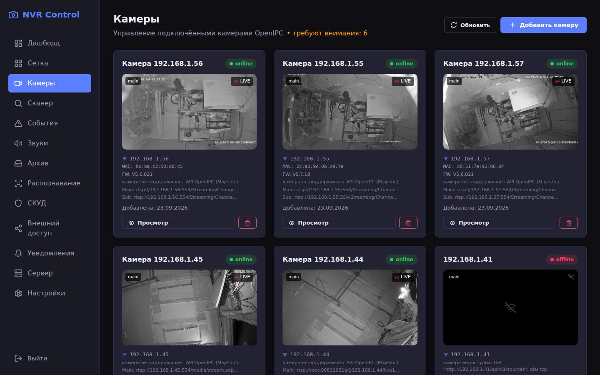

В карточке камеры — плеер с основным или дополнительным потоком,
кнопка звука и пульт PTZ для поворотных моделей.

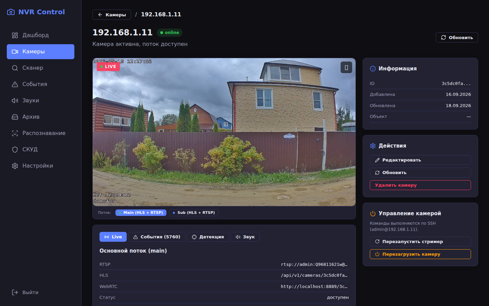

### Звук

Камера отдаёт звук в G.711, который браузеры не воспроизводят в HLS,
поэтому система перекодирует его в AAC и отдаёт отдельной дорожкой.
На панели видно кодек камеры, идёт ли перекодирование
и распознаются ли звуковые события.

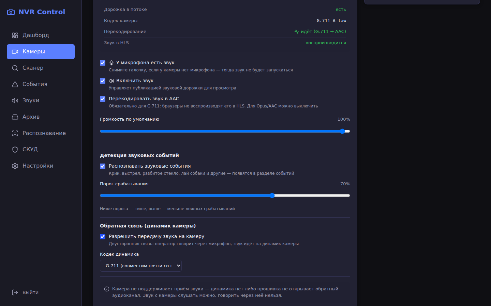

Звуковые события от YAMNet: выстрел, крик, разбитое стекло, лай собаки
и другие. Фильтры по классам и подсветка тревожных событий.

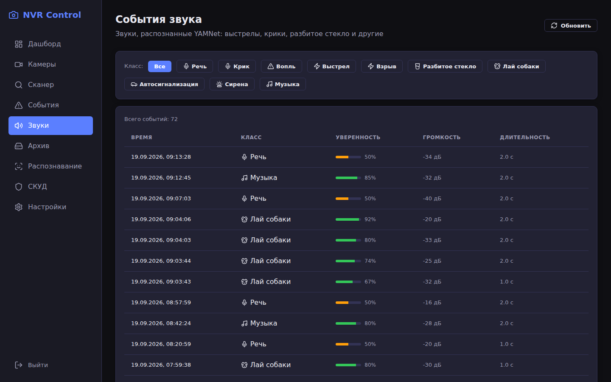

### Детекция объектов

Классы объектов, минимальная уверенность, зона поиска и линия пересечения.
Настройки применяются к конкретной камере и подхватываются детектором
автоматически, без перезапуска.

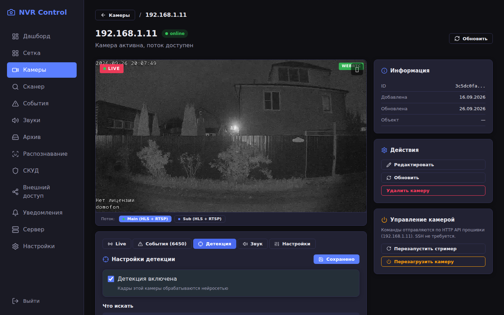

Найденные объекты заносятся в журнал со снимком, классом, уверенностью
и привязкой к камере.

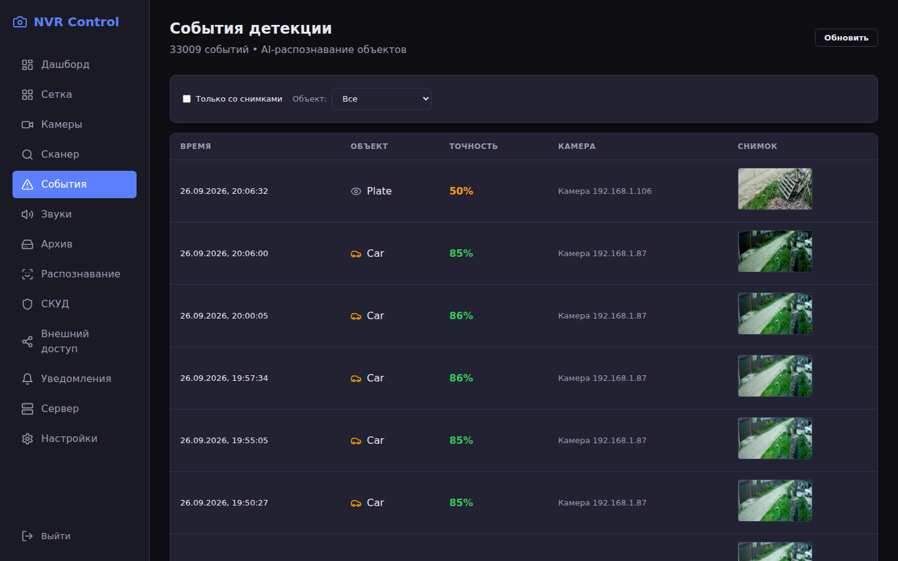

### Архив

Записи с указанием причины (объект, лицо, номер, линия, непрерывная запись),
размером, разрешением и сроком хранения. Воспроизведение прямо в браузере.

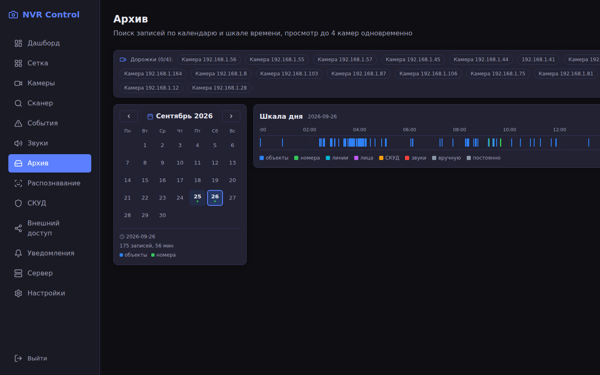

### Распознавание и СКУД

Справочники известных лиц и автомобильных номеров со статусами
«известный», «неизвестный», «запрещённый».

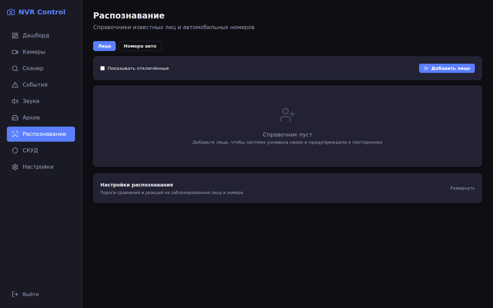

Сканер находит камеры в подсети, а перед добавлением можно проверить
поток: кодек, разрешение и наличие звука.

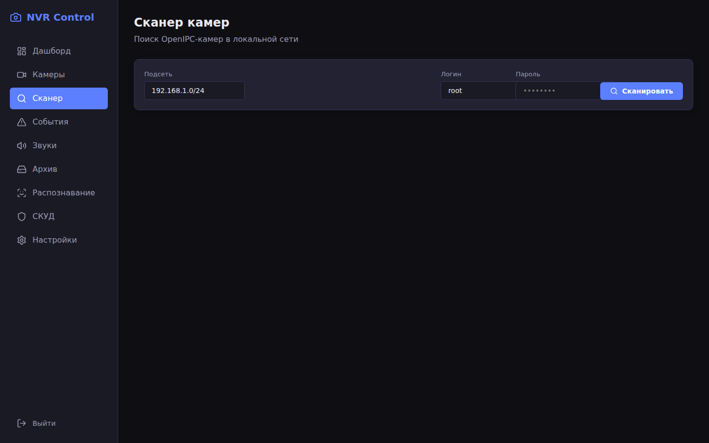

### Контроллер СКУД (SKUD, ESP32-P4)

Собственный контроллер доступа на ESP32-P4 (Wiegand-26, Ethernet, реле замка).
Прошивка и документация — в [`firmware/skud-esp32-p4/`](firmware/skud-esp32-p4/).

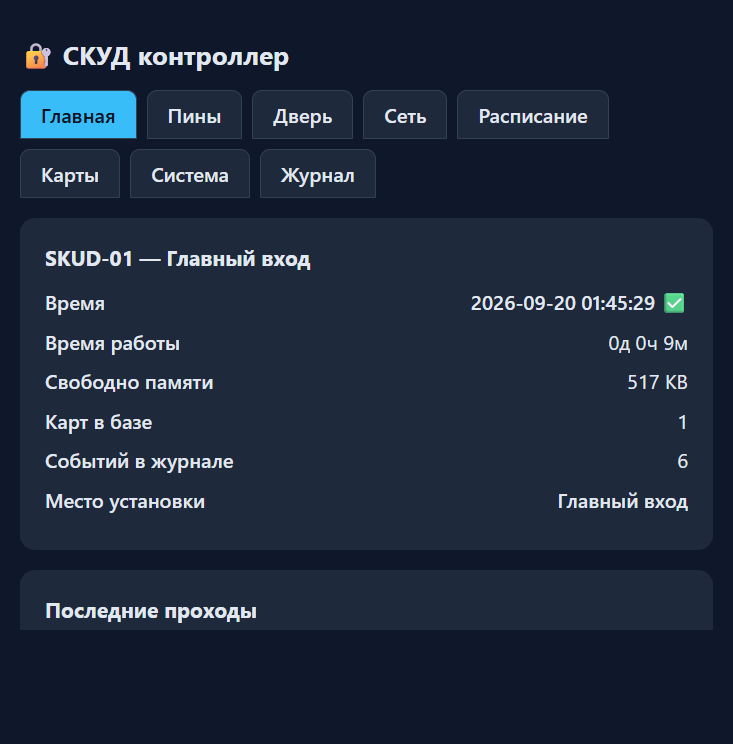

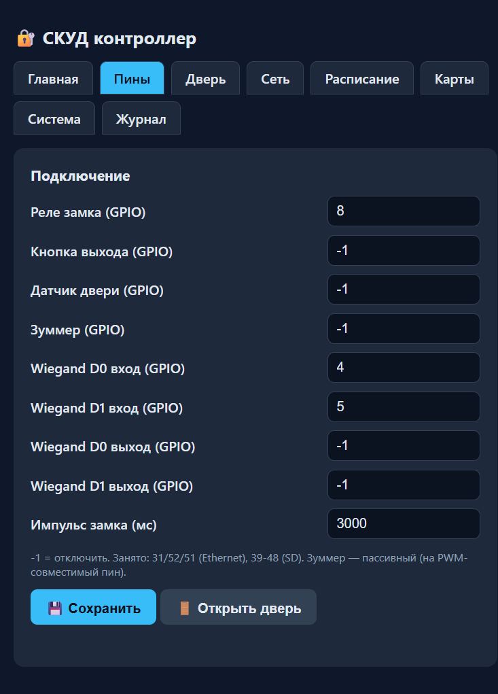

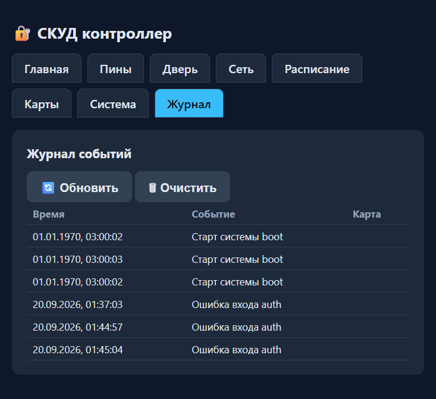

### Настройки и обзор

Единая страница настроек: где хранить записи и снимки (диск или S3),
параметры распознавания, срок хранения.

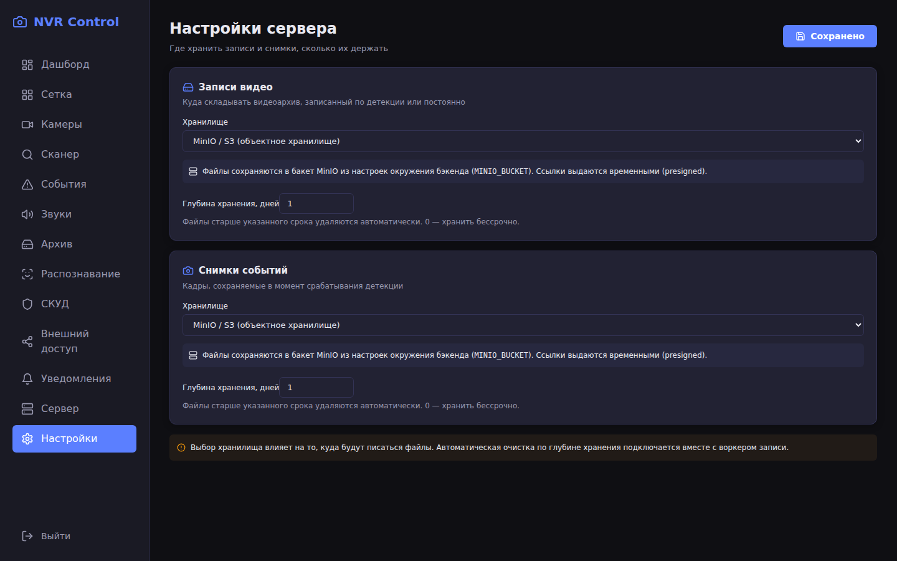

Сводка состояния системы: камеры онлайн, события за сутки, занятое место.

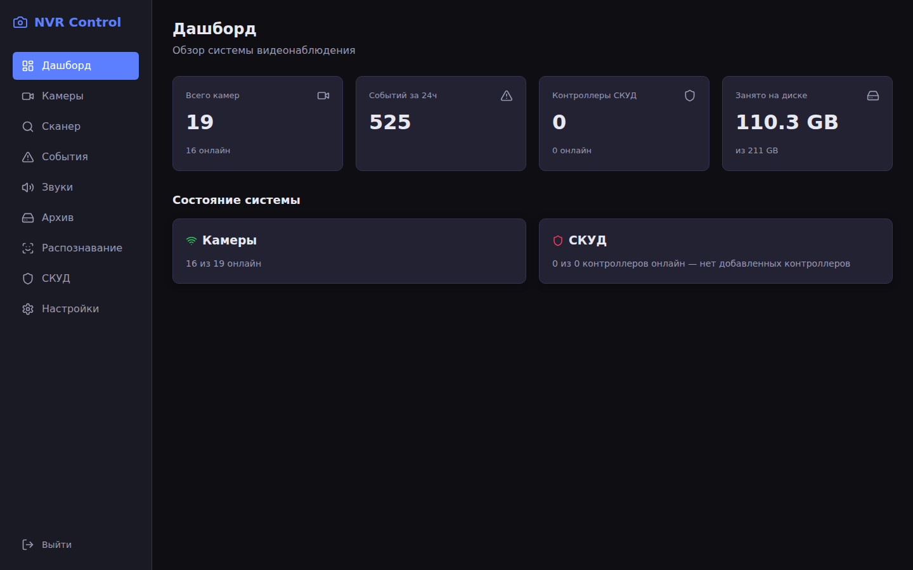

> Снимки сделаны на реальной системе. Пересоздать их можно командой
> `node scripts/make-screenshots.js` при запущенном сервере.

---

## Быстрый старт

### Требования

- Linux (проверено на Ubuntu)
- Docker 24+ и Docker Compose v2
- 2 ГБ ОЗУ и 10 ГБ диска минимум
- Камеры в той же сети, доступные по RTSP

### Установка

```bash
git clone https://github.com/himik19872/OpenIPC-NRV.git
cd OpenIPC-NRV

# Создаём конфигурацию и задаём секреты
cp .env.example .env
sed -i "s|^JWT_SECRET=.*|JWT_SECRET=$(openssl rand -hex 32)|" .env

# Запускаем
./scripts/nvr.sh start
```

Скрипт выведет адреса для доступа. Веб-интерфейс — `http://<IP сервера>:3001`,
вход `admin` / `admin123`.

> **Сразу смените пароль администратора.** Учётная запись создаётся сид-миграцией
> с общеизвестными данными.

### Добавление камер

1. Откройте раздел **Сканер** и укажите подсеть, например `192.168.1.0/24`.
2. Нажмите **Сканировать** — найденные камеры появятся списком.
3. Выберите нужные и добавьте: пути к потокам и учётные данные подставятся автоматически.
4. Либо добавьте вручную в разделе **Камеры**, указав `main_stream` и `sub_stream`.

Для камер OpenIPC используйте учётные данные, заданные в Majestic
(по умолчанию в проекте — `root` и пароль из прошивки).

---

## Автозапуск при загрузке

```bash
sudo ./scripts/install-service.sh
```

Создаётся служба systemd `nvr`, которая поднимает контейнеры при старте системы.
Контейнеры дополнительно имеют политику `restart: unless-stopped`, поэтому
перезапускаются после сбоев автоматически.

```bash
systemctl status nvr          # состояние службы
journalctl -u nvr -f          # логи запуска
sudo ./scripts/install-service.sh --uninstall   # удалить автозапуск
```

---

## Управление

```bash
./scripts/nvr.sh start      # запустить
./scripts/nvr.sh stop       # остановить
./scripts/nvr.sh restart    # перезапустить
./scripts/nvr.sh status     # состояние и адреса
./scripts/nvr.sh logs       # логи
./scripts/nvr.sh update     # пересобрать образы и обновить
./scripts/nvr.sh backup     # дамп базы данных в ./backups
```

---

## Документация

| Документ | Содержание |
|---|---|
| [docs/DEPLOYMENT.md](docs/DEPLOYMENT.md) | Подробное развёртывание, настройка, TLS, удалённый доступ |
| [docs/API.md](docs/API.md) | Полное описание REST API с примерами |
| [docs/ROADMAP.md](docs/ROADMAP.md) | План развития: мобильное приложение, CUDA-детекция, Home Assistant |
| [docs/ARCHITECTURE.md](docs/ARCHITECTURE.md) | Устройство системы, схема БД, принятые решения |
| [docs/TROUBLESHOOTING.md](docs/TROUBLESHOOTING.md) | Диагностика типовых проблем |
| [plans/](plans/) | Исходный проектный план |

Интерактивный список эндпоинтов доступен на работающем сервере:
`http://<IP сервера>:8080/api/v1/docs`

---

## Архитектура

| Компонент | Технология | Назначение |
|---|---|---|
| Бэкенд | Go 1.22, chi, pgx | REST API, бизнес-логика, управление камерами |
| Веб-интерфейс | React 18, TypeScript, Vite | SPA с плеером HLS, пультом PTZ и настройками |
| Медиасервер | MediaMTX | Приём RTSP, раздача HLS/WebRTC, запись |
| AI-детектор | Python, YOLOv8, YAMNet, InsightFace | Объекты, звуки, лица, номера (GPU CUDA) |
| Шина событий | NATS JetStream | Кадры от камер к детектору, события в БД |
| База данных | PostgreSQL 16 | Камеры, события, архив, звук, справочники лиц и номеров |
| Хранилище | MinIO (S3) либо локальный диск | Видеоархив и снимки |

### Структура репозитория

```
backend/            Go-бэкенд
  cmd/server/       точка входа
  internal/
    api/            роутер и HTTP-обработчики
    service/        бизнес-логика, PTZ, SSH, сканер, звук, распознавание
    repository/     PostgreSQL и MinIO
    media/          интеграция с медиасервером
    nats/           подписки на события детекции и звука
    tunnel/         управление WireGuard
  migrations/       SQL-миграции (001-007)
webui/              React SPA
ai-detector/        Python-сервис детекции (объекты, звук, лица, номера)
firmware/skud-esp32-p4/  прошивка контроллера СКУД (ESP-IDF v6.1)
scripts/            скрипты управления и установки
docs/               документация
plans/              проектные материалы
```

---

## Разработка

### Бэкенд

```bash
cd backend
go build ./...          # сборка
go vet ./...            # статический анализ
go test ./...           # тесты
```

Локальный запуск требует PostgreSQL на `localhost:5434`:

```bash
docker compose up -d postgres minio mediamtx nats
go run ./cmd/server
```

### Веб-интерфейс

```bash
cd webui
npm install
npm run dev             # dev-сервер на :3000 с прокси на :8080
npm run build           # production-сборка
```

### AI-детектор

```bash
cd ai-detector
pip install -r requirements.txt
python frame_publisher.py --rtsp rtsp://localhost:8554/<camera-id> --camera-id <uuid>
python main.py
```

Модель `yolov8n.pt` скачивается автоматически при первом запуске.

---

## Безопасность

Перед выводом сервера в интернет:

- [ ] Сменить `JWT_SECRET` (`openssl rand -hex 32`) и `DB_PASSWORD`
- [ ] Сменить пароль администратора в веб-интерфейсе
- [ ] Закрыть порты PostgreSQL (5434), MinIO (9000/9001), NATS (4222) от внешней сети
- [ ] Настроить TLS-терминацию (nginx/Caddy) перед веб-интерфейсом
- [ ] Ограничить доступ к MediaMTX API (9997)
- [ ] Не использовать учётные данные камер по умолчанию

Подробнее — в [docs/DEPLOYMENT.md](docs/DEPLOYMENT.md).

---

## Известные ограничения

| Ограничение | Причина | Обходной путь |
|---|---|---|
| Двусторонняя связь через динамик камеры не работает | Камеры не поддерживают обратный аудиоканал: в ответе `RTSP OPTIONS` нет методов `ANNOUNCE` и `RECORD`. Конвейер реализован и заработает на камерах с такой поддержкой | Проверяется автоматически: кнопка разговора появляется только при поддержке |
| Детекция звука расходует CPU | YAMNet работает на CPU, чтобы не конкурировать с GPU за детекцию объектов | Отключить ненужные камеры или классы звуков в настройках камеры |
| WireGuard-туннели не управляются автоматически | `internal/tunnel/wg_manager.go` — заготовка, нет интеграции с netlink | Настроить пиры вручную через `wg-quick` |
| Уведомления не отправляются | Эндпоинт push-токенов не реализован | — |

---

## Что нового

### 2026-09-19 — звук, распознавание, управление камерами

**Звук с камер**
- Прослушивание звука в плеере: отдельная аудиодорожка, синхронная с видео
- Перекодирование G.711 → AAC: браузеры не воспроизводят G.711 в HLS
- Перенаправление звука в отдельный поток MediaMTX, видео при этом не затрагивается

**Детекция звука**
- YAMNet (521 класс AudioSet): выстрел, крик, вопль, разбитое стекло, взрыв, лай, сирена, автосигнализация, речь, музыка
- Настройка порога, классов и кулдауна для каждой камеры
- Отсечение тишины по громкости — защита от ложных срабатываний на шуме микрофона
- Раздел **Звуки** в интерфейсе: фильтры по классам, тревожные события подсвечены

**Распознавание лиц и номеров**
- Справочники известных лиц и номеров, отметки «известный» / «неизвестный» / «запрещённый»
- Настраиваемая зона поиска номера — OCR больше не захватывает OSD-меню камеры
- Проверка формата номера с учётом региона

**Архив и запись**
- Запись по триггеру (объект, линия, лицо, номер) или постоянно
- Указание триггера в имени файла — понятно, почему началась запись
- Воспроизведение в браузере, выбор хранилища (локальный диск или S3)

**Управление камерами**
- Полное управление через веб-интерфейс: данные в PostgreSQL, без ручных конфигов
- Проверка потока до сохранения: кодек, разрешение, наличие звука
- Автозаполнение IP из RTSP-адреса
- Правка IP и пароля автоматически обновляет пути медиасервера
- Кнопки перезапуска камеры и её стримера
- Камеры без микрофона и динамика определяются автоматически

**GPU-ускорение**
- Детекция на CUDA (NVIDIA P104-100): ~13 мс на кадр против 83 мс на CPU

---

## Лицензия

Проект распространяется «как есть» для задач видеонаблюдения.
Сторонние компоненты сохраняют собственные лицензии (MediaMTX — MIT,
YOLOv8 — AGPL-3.0, MinIO — AGPL-3.0, PostgreSQL — PostgreSQL License).
