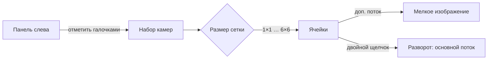

# Сетка камер

Режим наблюдения, при котором несколько камер видны одновременно.
Открывается из меню слева пунктом **«Сетка»**.

## Как устроено

## Размеры сетки

Выбирается кнопками: **1×1, 2×2, 3×3, 4×4, 5×5, 6×6**.

Предел — 6×6 (36 камер). Дальше смысла нет: даже на 4K-мониторе ячейка
выходит меньше 320 пикселей, и разглядеть в ней что-либо нельзя. К тому
же каждая ячейка — отдельный декодер видео, и десятки потоков положат
слабую машину.

## Два потока: почему в ячейке SUB, а в развороте MAIN

Камеры отдают два потока — основной и дополнительный:

| Поток | Разрешение | Битрейт | Где используется |
|---|---|---|---|
| **Основной (main)** | 1920×1080 и выше | высокий | разворот камеры на весь экран |
| **Дополнительный (sub)** | 704×576 | в разы ниже | ячейка сетки |

В ячейке размером 300–400 пикселей разницы между потоками не видно, а
нагрузка отличается в разы. На сетке 4×4 это 16 потоков: если взять
основные, канал и процессор не выдержат.

Поэтому в ячейке всегда идёт **доп. поток**, а при развороте — **основной**.

В углу ячейки стоит пометка `SUB`, в развороте — `MAIN`. Оператор видит,
что именно смотрит, и не удивляется разнице в качестве.

## Разворот камеры

Два способа:

- **Двойной щелчок** по ячейке;
- **кнопка** со стрелками в правом верхнем углу ячейки.

Развёрнутая камера занимает всю область, переключается на основной поток
и показывает звук. Кнопка **«Свернуть»** возвращает сетку.

## Порядок камер

Камеры в сетку расставляются **в том порядке, в котором их отметили**.
В панели слева у каждой отмеченной камеры виден её номер — оператор
заранее знает, в какую ячейку она попадёт.

Порядок важен: важные камеры ставят первыми, чтобы они оказались в
верхнем ряду.

## Порционное подключение

Плееры запускаются **не все сразу**, а по несколько за раз.

Каждый плеер — это соединение с сервером и декодирование видео. Если
запустить 16 сразу, они начинают конкурировать за канал: вместо
последовательного появления картинок получается долгое ожидание, а
потом рывки у всех одновременно.

В ячейках, где плеер ещё не запущен, видно надпись **«Запуск…»**.

## Почему в сетке нет WebRTC

WebRTC даёт минимальную задержку, но устанавливает **отдельное соединение
на каждую камеру**. На 16–25 ячейках это заметная нагрузка на сеть и
процессор, а в мелкой ячейке выигрыша не видно.

Поэтому в сетке используется HLS, а WebRTC включается при развороте
камеры — там важны и задержка, и качество.

## Сохранение раскладки

Набор камер и размер сетки **сохраняются автоматически** и
восстанавливаются при следующем открытии страницы.

Оператор расставляет камеры один раз — после перезахода (или перезапуска
приложения) сетка остаётся той же. Сохранение происходит в хранилище
браузера, на сервер ничего не отправляется.

Если камеру удалили из системы, её идентификатор убирается из раскладки
при следующей загрузке: ячейка не остаётся занятой несуществующей
камерой, а нумерация порядка не сбивается.

## Известные ограничения

- Раскладка **привязана к браузеру**: на другом компьютере или в другом
  браузере набор камер придётся расставить заново. Перенос раскладки
  между машинами (сцены на сервере) — в планах.
- Сетка работает и в браузере, и в десктоп-приложении: это одна и та же
  страница.
