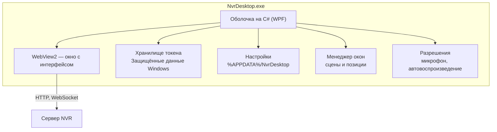

# Десктоп-приложение для Windows

Приложение для рабочих мест операторов: просмотр камер, работа с архивом,
разговор через динамик камеры. Отличается от веб-интерфейса тем, что
работает как обычная программа Windows, а не вкладка браузера.

## Что именно не устраивает в браузере

| Проблема | Причина | Что даёт приложение |
|---|---|---|
| Микрофон спрашивают при каждом входе | Браузер требует подтверждения и не запоминает его навсегда | Разрешение выдаётся один раз при первом запуске |
| Токен лежит в `localStorage` | Любой скрипт на странице может его прочитать | Хранится в защищённом хранилище Windows |
| Нельзя развести сцены по мониторам | Вкладка живёт в одном окне | Отдельные окна для разных сцен, каждое помнит своё место |
| Положение окон не сохраняется | Браузер не даёт этого делать | Каждое окно восстанавливается там, где его закрыли |

## Выбор технологии

Рассматривались три варианта.

| Вариант | Плюсы | Минусы |
|---|---|---|
| **Обёртка вокруг веб-интерфейса** (WPF + WebView2) | Переиспользует все 12 страниц и 11 компонентов, которые уже работают. Срок — дни, а не месяцы | Интерфейс остаётся веб-страницей внутри окна |
| Полностью нативный на C# (WPF без WebView) | Полный контроль над интерфейсом | Нужно заново написать плеер, работу с WebRTC, таблицы, формы. Месяцы работы |
| .NET MAUI | Кроссплатформенность | Слабый контроль над окнами на нескольких мониторах |

**Решение: обёртка на WPF + WebView2.**

Причина не в экономии времени как таковой. Веб-интерфейс уже содержит
работающий плеер с поддержкой WebRTC, панель разговора, работу с архивом
и событиями. Переписывание всего этого на C# не улучшит ни одну из трёх
задач, ради которых делается приложение: доступ к микрофону, хранение
токена и работа с окнами решаются на уровне оболочки.

При этом обёртка не мешает позже заменить любую часть на нативную: окна,
меню, уведомления и хранилище токена живут в C# и не зависят от страницы.

## Архитектура



### Разделение работы

**C# отвечает за то, чего нет в браузере:**

- окна и их положение на мониторах;
- хранение токена в защищённом виде;
- разрешения (микрофон, звук, уведомления) — выдаются один раз;
- меню приложения, горячие клавиши, автозапуск;
- системный трей и уведомления Windows.

**Веб-страница отвечает за то, что уже работает:**

- плеер WebRTC и HLS, переключение потоков;
- разговор через динамик камеры;
- архив, события, распознавание, СКУД;
- сканер камер.

## Сцены и мониторы

«Сцена» — это набор камер, который оператор хочет видеть вместе.

Каждая сцена открывается в своём окне. Окно помнит:

- какой монитор использовался;
- положение и размер в границах этого монитора;
- развёрнуто ли на весь экран;
- какие камеры и в каком порядке показывались.

Позиция хранится не в абсолютных координатах, а **относительно своего
монитора**. Причина: при отключении второго экрана абсолютные координаты
попадают за пределы рабочего стола, и окно становится недоступным. Если
запомненный монитор не найден при запуске, окно открывается на основном.

## Хранение токена

Токен доступа не хранится в файле рядом с настройками и не передаётся в
страницу как обычная переменная.

Последовательность:

1. C# шифрует токен средствами Windows (`ProtectedData` с областью
   «текущий пользователь») и сохраняет зашифрованным.
2. При запуске C# расшифровывает его и передаёт странице через
   механизм обмена сообщениями WebView2 — не через адресную строку,
   чтобы он не попал в журналы.
3. Страница хранит его только в памяти. Запись в `localStorage` браузера
   отключается, чтобы токен не остался на диске в открытом виде.

## Этапы

### Первая версия (прототип)

- Окно входа с адресом сервера, логином и паролем.
- Главное окно со списком камер.
- Просмотр камеры в отдельном окне (WebRTC с откатом на HLS).
- Разговор через динамик камеры.
- Запоминание положения окон.
- Хранение токена в защищённом виде.
- Сборка `.exe` через GitHub Actions.

### Дальше

- Сцены: сохранение набора камер и раскладки.
- Окно с сеткой камер.
- Уведомления Windows о событиях.
- Автозапуск с системой и работа в трее.
- Горячие клавиши для переключения сцен.

## Сборка

Собирается на Windows: WPF не собирается на Linux.

Автоматическая сборка настроена в GitHub Actions — при отправке кода
в ветку `main` создаётся готовый `.exe` и прикладывается к сборке.

Сборка вручную на машине с Windows:

```
git clone https://github.com/himik19872/OpenIPC-NRV.git
cd OpenIPC-NRV/desktop
dotnet publish src/NvrDesktop/NvrDesktop.csproj -c Release -r win-x64
```

Готовый файл появится в `src/NvrDesktop/bin/Release/net8.0-windows/win-x64/publish/`.

## Требования к системе

- Windows 10 или новее (нужен WebView2 — в Windows 11 уже встроен,
  в Windows 10 ставится вместе с обновлениями Edge);
- .NET 8 для сборки из исходников (для готового `.exe` не требуется —
  он собирается самодостаточным).
