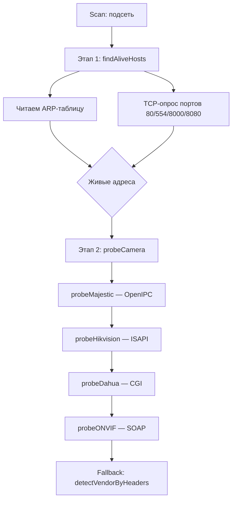

# Сканер камер

Модуль ищет IP-камеры в подсети, определяет производителя и подбирает
корректные адреса RTSP-потоков. Работает через веб-интерфейс на странице
«Сканер камер».

## Как работает

Сканирование разбито на два этапа. Это принципиально: наивный подход, при
котором HTTP-API опрашивается у каждого адреса подсети, занимает минуты и
почти всегда не успевает завершиться до таймаута запроса.



### Этап 1. Отбор живых адресов

Опрашивать HTTP-API всех 254 адресов нельзя: на каждый неотвечающий адрес
уходит ожидание таймаута, и скан растягивается на минуты.

Сначала за пару секунд выясняется, кто вообще отвечает. Используются два
признака, потому что ни один не даёт полной картины:

- **ARP-таблица** — бесплатно, но знает только тех, с кем узел уже
  общался;
- **TCP-опрос портов** 80, 554, 8000, 8080 — быстрее и точнее ICMP, не
  требует прав root и специально нацелен на порты камер.

Проверка идёт в 256 потоков с таймаутом 500 мс.

### Этап 2. Опрос протоколов

Живые адреса проверяются цепочкой проберов. Опрос идёт в 24 потока —
меньше, чем на первом этапе: каждый опрос порождает серию HTTP-запросов с
перебором учётных данных, и сотня одновременных серий перегружает сеть.

## Поддерживаемые производители

| Производитель | Как определяется | RTSP-путь |
|---|---|---|
| OpenIPC | `/api/v1/config.json`, `Majestic` | `/stream=0`, `/stream=1` |
| Hikvision | ISAPI `/ISAPI/System/deviceInfo` | `/Streaming/Channels/101`, `102` |
| Dahua | CGI `/cgi-bin/magicBox.cgi` | `/cam/realmonitor?channel=1&subtype=0` |
| ONVIF | SOAP `GetDeviceInformation` | по вендору из ответа |
| Axis | `Server: Rapid Logic`, `realm="streaming_server"` | `/stream=0` |
| Uniview, Reolink, TVT, Xiongmai, Bosch, Samsung, Vivotek, Panasonic, Sony | ONVIF / заголовки | `/stream=0` |
| generic | не опознан, но RTSP открыт | `/stream=0`, `/stream=1` |

### ONVIF как универсальный определитель

ONVIF — общий язык IP-камер, поэтому он идёт последним в цепочке: это
самый «дорогой» запрос, зато единственный, кто опознаёт камеру
неизвестного производителя и обычно сообщает модель и прошивку.

Авторизация — WS-Security с digest-паролем:

$$
\text{digest} = \text{Base64}\big(\text{SHA1}(\text{nonce} \| \text{created} \| \text{password})\big)
$$

`nonce` должен быть новым в каждом запросе, иначе камера отклонит
повторный запрос как воспроизведение.

Разбор ответа идёт по **локальным именам тегов**, а не по префиксам:
Hikvision использует `tds:Manufacturer`, Dahua — `ns2:Manufacturer`, и
привязка к префиксу сломала бы половину камер.

## Определение по заголовкам

Когда фирменные API требуют учётных данных, которых у нас нет, остаются
заголовки веб-интерфейса — они отдаются всегда. По ним видно и вендора, и
то, что устройство вообще является камерой.

Порядок проверок важен. **OpenIPC отдаёт страницу-редирект на
`/cgi-bin/live.cgi`**, поэтому признак «`/cgi-bin/`» указывает на Dahua
только после того, как исключён OpenIPC. Именно из-за обратного порядка
все камеры OpenIPC одно время определялись как Dahua и получали чужие
RTSP-пути.

## API

```http
POST /api/v1/scanner/scan
Authorization: Bearer <token>
Content-Type: application/json

{"subnet": "192.168.1.0/24", "username": "root", "password": ""}
```

Ответ:

```json
{
  "subnet": "192.168.1.0/24",
  "total": 254,
  "found": 17,
  "cameras": [
    {
      "ip": "192.168.1.41",
      "vendor": "openipc",
      "model": "gc2053",
      "firmware": "OpenIPC 3.0.0",
      "mac": "aa:bb:cc:dd:ee:ff",
      "main_stream": "rtsp://192.168.1.41:554/stream=0",
      "sub_stream": "rtsp://192.168.1.41:554/stream=1",
      "online": true
    }
  ]
}
```

```http
POST /api/v1/scanner/probe
{"ip": "192.168.1.41", "username": "root", "password": ""}
```

## Таймауты

Сканирование подсети /24 занимает **20–30 секунд**. Важно, чтобы этот
интервал пережили все участники:

| Участник | Таймаут | Почему |
|---|---|---|
| axios (веб-интерфейс) | 15 с по умолчанию | **Мало.** Для `scan` задано 300 с, для `probe` — 60 с |
| nginx `proxy_read_timeout` | 300 с | Совпадает с клиентом |
| HTTP-клиент сканера | 3 с | На один запрос к камере |

Если клиентский таймаут меньше времени сканирования, пользователь видит
«Ошибка сканирования» при том, что сканирование ещё идёт. Именно это было
основной причиной жалоб на неработающий сканер.

## Проверка

```bash
cd backend
go test -run "TestClassifyVendorPage|TestParseDeviceInformation|TestNormalizeVendor|TestONVIFEnvelope" -v ./internal/service/
```

Тесты не требуют сети: проверяются разбор SOAP, приведение названий
производителей к идентификаторам, экранирование XML и классификация
страниц.
